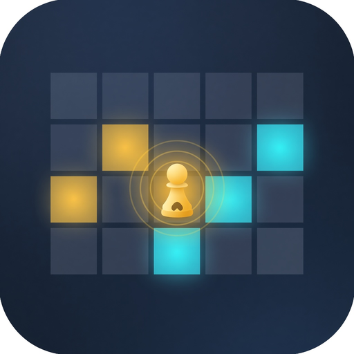

# Auto Chess Aura Lab · 自走棋辐射对比工具

<p align="center">
  
</p>

<p align="center">
  给 5×4 自走棋棋盘用的英雄辐射 / 光环站位对比工具。<br>
  本地运行，数据留在浏览器里。
</p>

|             | 名称                 |
| ----------- | -------------------- |
| GitHub 仓库 | `autochess-aura-lab` |
| 英文名      | Auto Chess Aura Lab  |
| 中文名      | 自走棋辐射对比工具   |

把棋子放到棋盘上，对局开始后自动战斗——这类轻策略自走棋都适用。这里的「辐射」就是棋子光环 / 能量传递能覆盖到的格子。

内置图鉴按《爪爪大乱斗》整理；其它同棋盘游戏可以自己画形状，或用 JSON / 分享链接导入。

### 适用游戏

棋盘是 **5×4** 时最贴合，尤其是同阶合成、站位光环那一类：

| 游戏         | 题材 / 特点                                         |
| ------------ | --------------------------------------------------- |
| [爪爪大乱斗] | 萌宠动物。两两合成升星，能量传递，约 5 分钟一局 1V1 |
| [勇者乱斗]   | 蔬果拟人。合成进化 + 站位博弈，还有双人协作         |
| [黎明特工]   | 英雄养成自走棋。种族职业搭配，白阶合成到橙阶        |

---

## 它做什么

在 **5 列 × 4 行** 棋盘上录入英雄位置和辐射形状，然后立刻看到：

- 这个棋子站在每个格子上，还能打到棋盘内多少格
- 最高可辐射、最佳站位数、总辐射数量
- 多个英雄并排对比

左边结果棋盘不是「辐射落在哪里」，而是 **「如果英雄站在这里，有效辐射还有几格」**。越界的格子会被丢掉，所以边角通常比中央更吃亏。

---

## 功能

- 右侧棋盘放置英雄和辐射格子，支持点击或拖放
- 左侧热力图显示每个站位的有效辐射数
- 英雄卡片带 5×4 辐射形状预览
- 等级：绿 / 蓝 / 紫 / 金
- 内置图鉴一键导入（绿 5、蓝 9、紫 9、金 34）
- JSON 导入 / 导出，合并或替换
- 分享链接（数据写在 URL 里）
- 撤销 / 重做、浅色 / 深色主题
- 进度保存在 `localStorage`，不需要账号

---

## 本地运行

需要 Node.js 18+。

```bash
npm install
npm run dev
```

浏览器打开终端里提示的本地地址，一般是 `http://localhost:5173`。

```bash
npm run build    # 类型检查并打包
npm run preview  # 预览生产构建
npm test         # 校验内置图鉴和页面接入
```

---

## 怎么用

1. 点 **导入**，直接选绿色 / 蓝色 / 紫色 / 金色图鉴，或上传自己导出的 JSON。
2. 在英雄卡片里选中要看的棋子；悬停卡片时，左侧棋盘会切到该棋子的站位热力图。
3. 要自己做一个：点 **添加英雄**，先放英雄格子，再放辐射格子，填名称后保存。
4. 对比表按最高可辐射、最佳位置数、总辐射数量等列排序。
5. 需要带走数据时，用 **导出** 下载 JSON，或 **分享链接** 复制 URL。

---

## 技术栈

Vite 7 · React 19 · TypeScript

棋盘计算、导入导出和图鉴都在前端完成，没有后端。

---

## English

**Auto Chess Aura Lab** is a browser tool for comparing hero aura / radiation shapes on a **5×4** auto-chess board.

It started with 爪爪大乱斗 energy-transfer ranges. The same workflow fits other light auto-battlers: 勇者乱斗, 召唤英雄, 矮人军团自走棋, Super Auto Pets, 西行乱斗, Auto Chess, Magic Chess: Go Go, TFT / 金铲铲之战, and similar merge-and-place games.

Pick a cell and the left board answers: _if this piece stood here, how many aura cells would still land on the board?_ Corner placements lose coverage; center placements usually keep more.

You can import built-in rarity packs, draw custom shapes, compare selected heroes, export JSON, and share a link. Everything stays in local storage.

```bash
npm install
npm run dev
```
